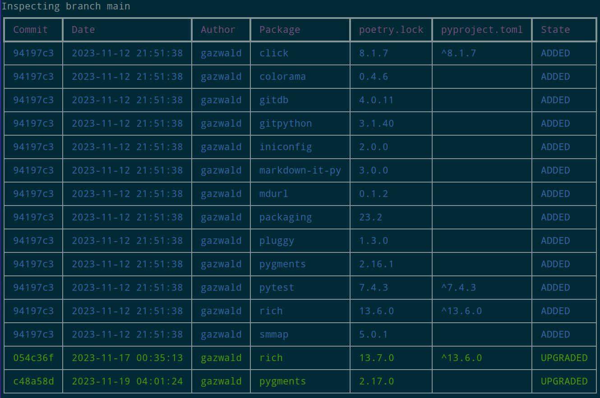

# Poetry Delta

A simple script that iterates through all the commits in a repository that contain modifications to `poetry.lock` or
`pyproject.toml` and generates a table that shows when a given dependency was added/removed/upgraded/downgraded.

For example in this repository:



## Usage

### Direct

```console
$ poetry run ./delta/run.py --path <path to your git repository>
```

By default it will look in the current directory, under the active branch, and show all changes for all packages.

```console
./delta/run.py --help
Usage: run.py [OPTIONS]

Options:
  --path TEXT     Path to the repository; default is cwd
  --branch TEXT   Branch to inspect
  --package TEXT  Package to filter on
  --rev TEXT      Rev, see `git rev-parse` for details.
  --help          Show this message and exit.
```

### Docker

By default the `run` script will mount either the current working directory or the first argument as `/mnt`.

```console
$ ./scripts/run <path to your git repository>
...
+++ Running poetry-delta +++
+++ Path: /home/user/projects/gazwald/poetry-delta +++
...
```

or, if you're running the container manually, you'll need to build the image, then bind mount the path to the git
repository to `/mnt` as that is where the container expects the repository to be.

```console
$ ./scripts/build
$ docker run \
      --interactive \
      --rm \
      --tty \
      --volume "${PWD}:/mnt" \
      poetry-delta
```

## TODO

- Actions
- Tests
- Colour blind mode(s)
